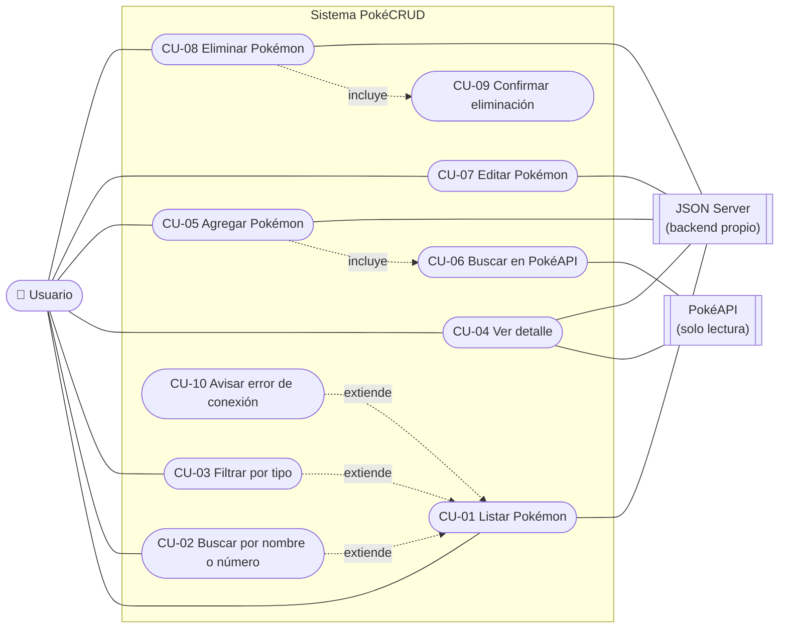
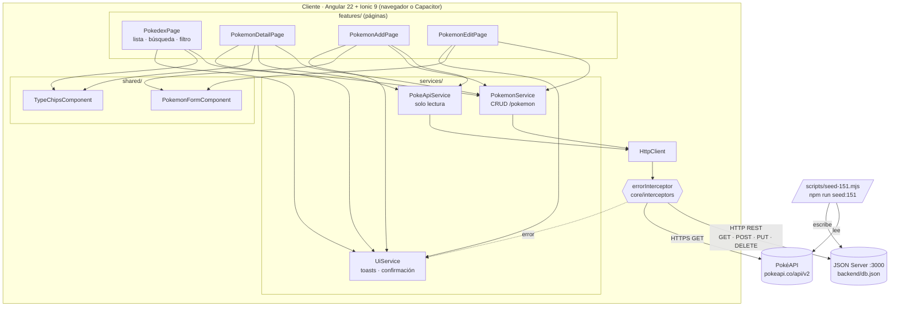
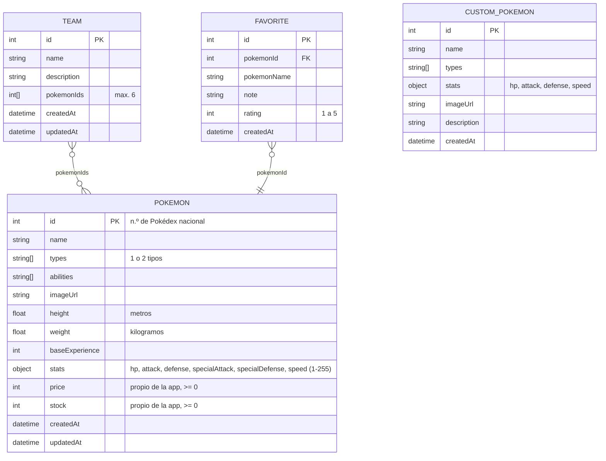
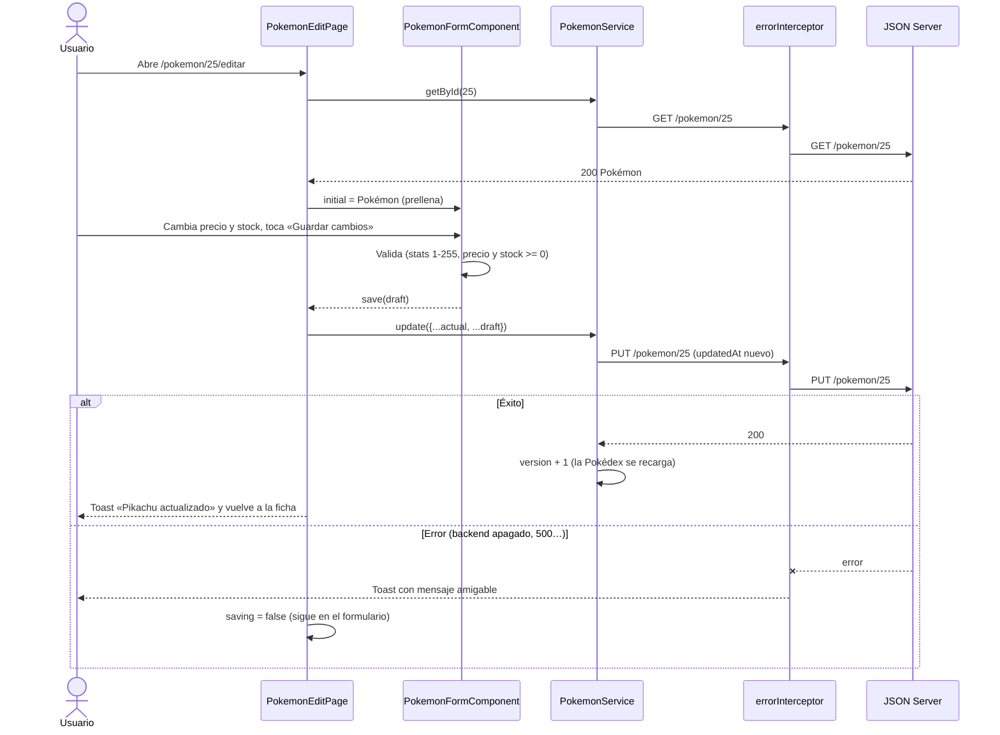

# Diagramas

**Tareas:** TK-02 (casos de uso) y TK-03 (arquitectura y modelo de datos).

Los diagramas están escritos en [Mermaid](https://mermaid.js.org/), así que GitHub los muestra como imagen directamente en este archivo. Para exportarlos a PNG (por ejemplo, para el informe) se puede pegar cada bloque en <https://mermaid.live>.

## 1. Diagrama de casos de uso

El sistema tiene un solo actor humano, el **usuario de la tienda**, que administra el catálogo. PokéAPI y JSON Server son sistemas externos.

| Caso  | Historia | Descripción breve                                                                            |
| ----- | -------- | -------------------------------------------------------------------------------------------- |
| CU-01 | HU-03    | Ver los Pokémon guardados, 20 a la vez, con número, imagen, nombre, tipos, precio y stock    |
| CU-02 | HU-05    | Escribir un nombre parcial (`char`) o un número (`25`, `#025`) para filtrar la lista         |
| CU-03 | HU-14    | Elegir un tipo para ver solo los Pokémon que lo tienen; se combina con la búsqueda           |
| CU-04 | HU-04    | Ver la ficha con datos físicos, descripción en español (PokéAPI), habilidades y estadísticas |
| CU-05 | HU-03    | Elegir un Pokémon de PokéAPI, revisar el formulario prellenado y guardarlo                   |
| CU-06 | HU-03    | Buscar cualquier Pokémon de PokéAPI; si ya está guardado, se ofrece editarlo                 |
| CU-07 | HU-03    | Cambiar cualquier dato (incluidos precio y stock) con validaciones                           |
| CU-08 | HU-03    | Quitar un Pokémon del catálogo desde la ficha o deslizando el elemento de la lista           |
| CU-09 | HU-03    | Diálogo «¿Seguro que quieres eliminar…?» con Cancelar / Eliminar                             |
| CU-10 | HU-07    | Si una petición falla, mostrar un mensaje amigable y, en la lista, el botón «Reintentar»     |

## 2. Diagrama de arquitectura

Aplicación de una sola página (SPA) en el navegador o en el celular, con dos fuentes de datos.

**Decisiones principales**

- **Backend propio:** PokéAPI es de solo lectura, así que los datos del CRUD viven en JSON Server. PokéAPI solo se usa para precargar los 151 y para buscar Pokémon nuevos al agregarlos.
- **Componentes standalone y signals:** cada página declara sus dependencias y su estado con `signal`/`computed`; no hay `NgModule`.
- **Recarga automática:** `PokemonService.version` cambia en cada alta, edición o baja, y la Pokédex se recarga sola.
- **Errores centralizados:** el interceptor muestra el mensaje y las páginas solo restauran su estado (spinner, «Reintentar»).

## 3. Modelo de datos

Recursos de `backend/db.json`. En esta entrega la app solo usa `pokemon`; `teams`, `favorites` y `customPokemon` siguen en el backend para cuando se activen esas secciones.

## 4. Secuencia de una operación CRUD (UPDATE)

