# Manual de usuario

**PokéCRUD** · Tarea TK-06 · Octubre de 2026

PokéCRUD es un catálogo de Pokémon para una tienda: permite consultar los Pokémon, ver su ficha, agregar nuevos desde la PokéAPI, cambiar su precio, stock y demás datos, y eliminarlos. Funciona en el computador y en el celular.

## 1. Antes de empezar

La persona encargada debe dejar encendidos el backend y la aplicación (ver el [README](../README.md#cómo-correr-el-proyecto)):

```bash
npm run api       # base de datos en http://localhost:3000
npx ionic serve   # aplicación en http://localhost:8100
```

Luego se abre `http://localhost:8100` en el navegador. Para verla como en el celular: en Chrome, F12 y luego el ícono de dispositivo móvil (Ctrl+Shift+M).

## 2. Pokédex (pantalla principal)

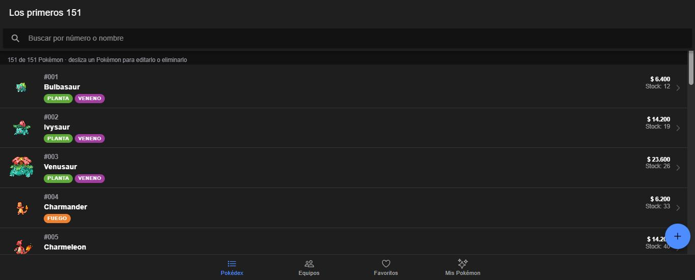

Cada fila muestra el **número**, la **imagen**, el **nombre**, los **tipos** con su color, el **precio** y el **stock**. Si el stock es 0, aparece en rojo.

- Se cargan 20 Pokémon; al bajar hasta el final aparecen 20 más.
- Para actualizar la lista, arrastra hacia abajo desde arriba (en el celular).
- El texto sobre la lista indica cuántos Pokémon se están viendo, por ejemplo «12 de 151 Pokémon de tipo Fuego».

### Buscar

Escribe en la barra superior:

- un **nombre** o parte de él: `char` encuentra Charmander, Charmeleon y Charizard;
- un **número**: `25` o `#025` encuentra a Pikachu.

Si no hay coincidencias aparece «No se encontró ningún Pokémon». Para volver a ver todos, borra el texto con la ✕.

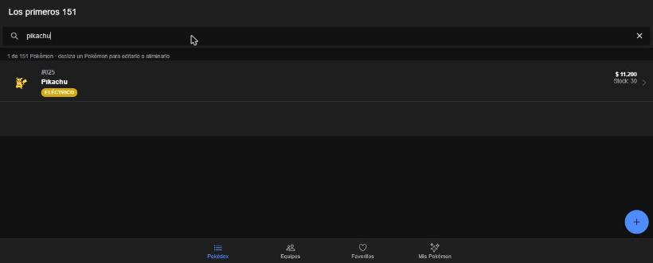

### Filtrar por tipo

Debajo de la búsqueda hay una fila de chips con los tipos (Fuego, Agua, Planta…). Toca uno para ver solo los Pokémon de ese tipo. Los que tienen dos tipos aparecen en ambos filtros.

- El filtro se combina con la búsqueda: con «Fuego» elegido y `char` escrito, solo salen Charmander, Charmeleon y Charizard.
- Para quitar el filtro, toca **Todos** o vuelve a tocar el tipo elegido.
- En el celular, desliza la fila de chips hacia la izquierda para ver más tipos.

| Celular                                                       | Filtro y búsqueda                                                    |
| ------------------------------------------------------------- | -------------------------------------------------------------------- |
| 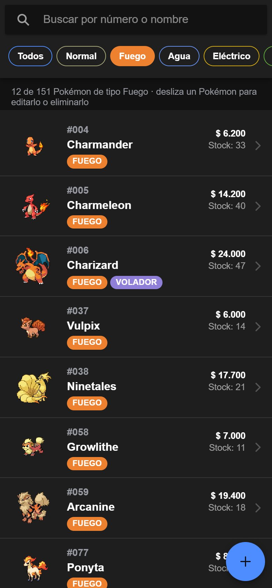 | 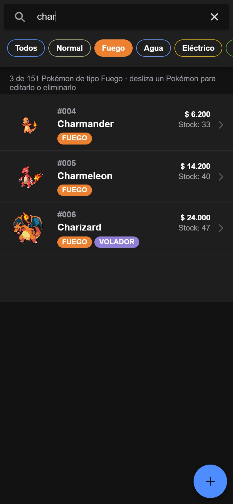 |

## 3. Ver la ficha de un Pokémon

Toca cualquier Pokémon de la lista. La ficha muestra la imagen oficial, los tipos, el precio, el stock, la altura, el peso, la experiencia base, la descripción en español, las habilidades y las seis estadísticas base en barras.

Arriba a la derecha están los botones **editar** (lápiz) y **eliminar** (papelera).

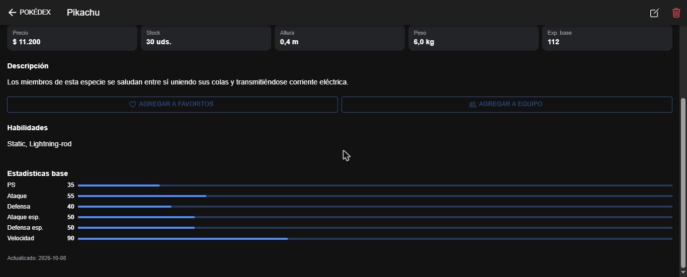

## 4. Agregar un Pokémon

1. En la Pokédex, toca el botón redondo **+** (abajo a la derecha).
2. Escribe el número o el nombre de cualquier Pokémon (de cualquier generación, por ejemplo `448` o `lucario`) y elígelo de la lista.
3. El formulario aparece lleno con los datos de la PokéAPI. Revisa o cambia lo que necesites, en especial el **precio** y el **stock**.
4. Toca **Agregar a la Pokédex**. Aparece el mensaje «… agregado a la Pokédex» y vuelves a la lista.

Si el Pokémon ya está en el catálogo, la app lo avisa y muestra el botón **Editarlo** para no duplicarlo. Para buscar otro, toca **Buscar otro**.

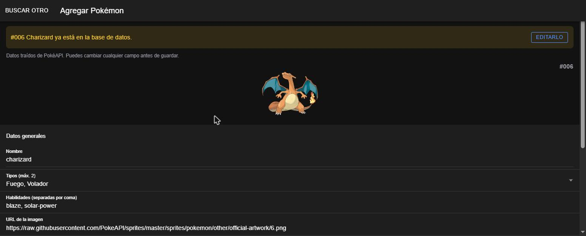

## 5. Editar un Pokémon

Hay dos formas:

- desde la ficha, con el botón **lápiz**;
- desde la lista, deslizando el Pokémon hacia la izquierda y tocando el **lápiz azul**.

Cambia los datos y toca **Guardar cambios**. Verás «… actualizado» y la ficha con los valores nuevos. **Cancelar** (arriba a la izquierda) sale sin guardar.

| Formulario                                           | Cambios guardados                                    |
| ---------------------------------------------------- | ---------------------------------------------------- |
| 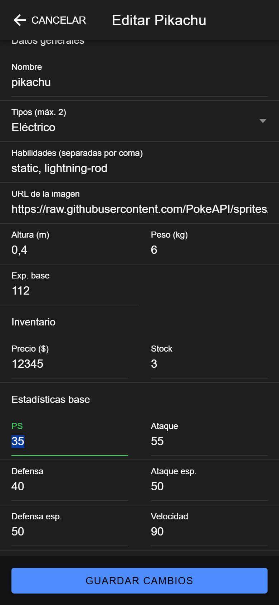 | 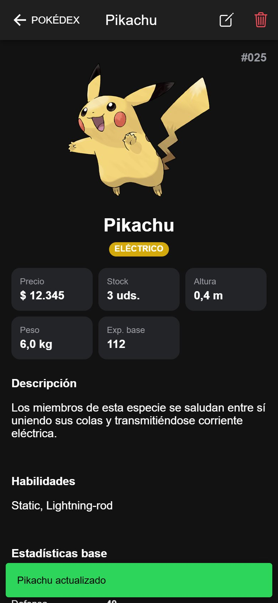 |

### Reglas de los campos

| Campo                                                                    | Regla                        |
| ------------------------------------------------------------------------ | ---------------------------- |
| Nombre                                                                   | Obligatorio, hasta 30 letras |
| Tipos                                                                    | Uno o dos                    |
| Precio y stock                                                           | 0 o más                      |
| Altura, peso y experiencia base                                          | 0 o más                      |
| Estadísticas (PS, Ataque, Defensa, Ataque esp., Defensa esp., Velocidad) | Entre 1 y 255                |

Si un campo no cumple la regla, se marca en rojo con el motivo (por ejemplo «Debe ser 0 o más») y no se guarda nada hasta corregirlo.

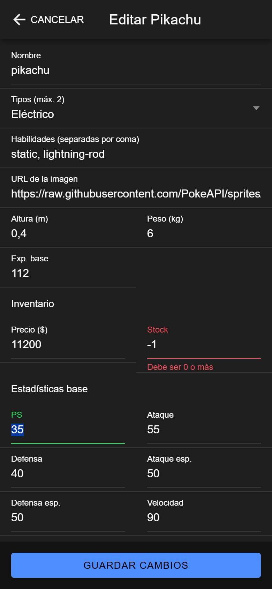

## 6. Eliminar un Pokémon

1. Desde la ficha toca la **papelera**, o en la lista desliza el Pokémon hacia la izquierda y toca la **papelera roja**.
2. Aparece «¿Seguro que quieres eliminar a …?».
3. **Eliminar** lo borra del catálogo («… eliminado»); **Cancelar** no hace nada.

Un Pokémon eliminado se puede volver a agregar con el botón **+**.

| Confirmación                                                | Resultado                                       |
| ----------------------------------------------------------- | ----------------------------------------------- |
| 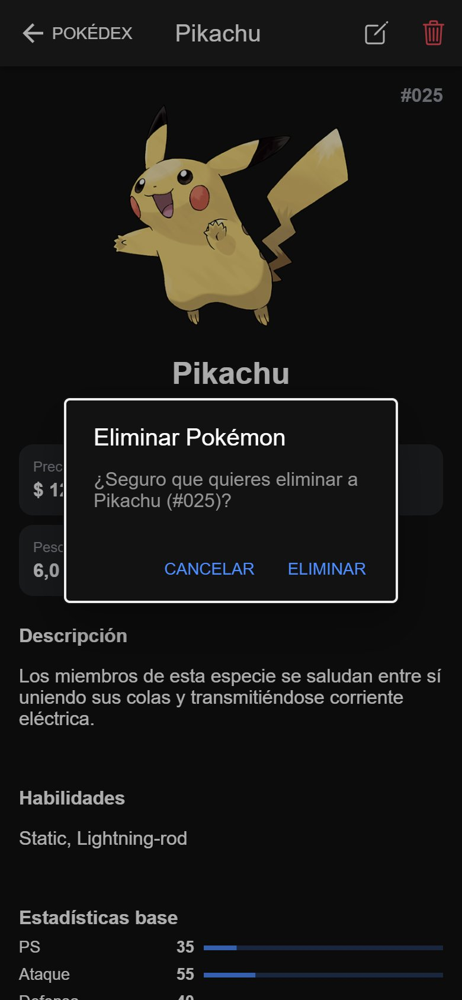 | 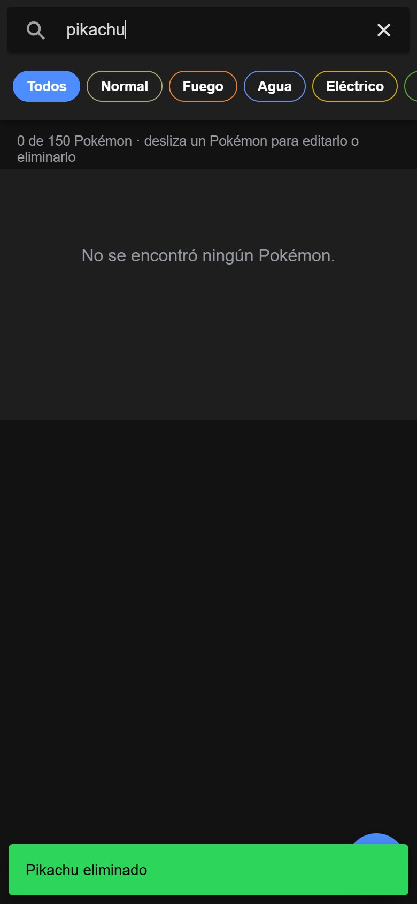 |

## 7. Mensajes de error

| Mensaje                                                                    | Qué significa                         | Qué hacer                                     |
| -------------------------------------------------------------------------- | ------------------------------------- | --------------------------------------------- |
| «No se pudo conectar con la base de datos. ¿Está corriendo «npm run api»?» | El backend está apagado               | Encender `npm run api` y tocar **Reintentar** |
| «No se pudo conectar con PokéAPI. Revisa tu conexión a internet.»          | No hay internet o PokéAPI no responde | Revisar la conexión e intentar de nuevo       |
| «El servidor tuvo un problema…»                                            | Error interno del backend             | Intentar de nuevo en un momento               |
| «No se encontró «…» en PokéAPI.»                                           | El nombre o número no existe          | Revisar lo que se escribió                    |

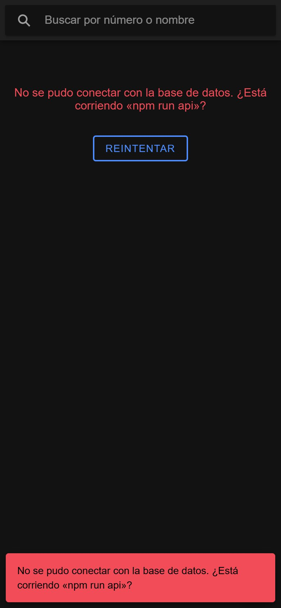

## 8. Preguntas frecuentes

**¿Por qué hay 151 Pokémon al empezar?** La base de datos se precarga con la primera generación. Se pueden agregar más con el botón **+**.

**¿De dónde salen el precio y el stock?** La PokéAPI no los tiene. Al precargar se calcula un precio (experiencia base × 100) y un stock inicial; luego se cambian desde **Editar**.

**¿Cómo vuelvo a los datos iniciales?** Detén el backend, ejecuta `npm run api:reset` y vuelve a encenderlo.

**¿El modo oscuro?** La app usa automáticamente el tema claro u oscuro del sistema operativo.
